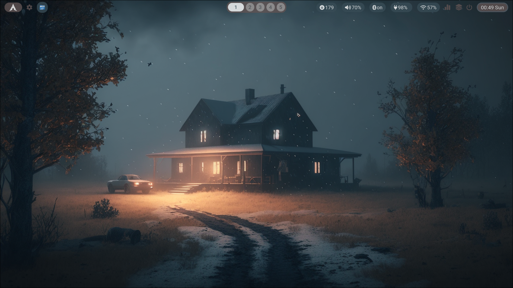
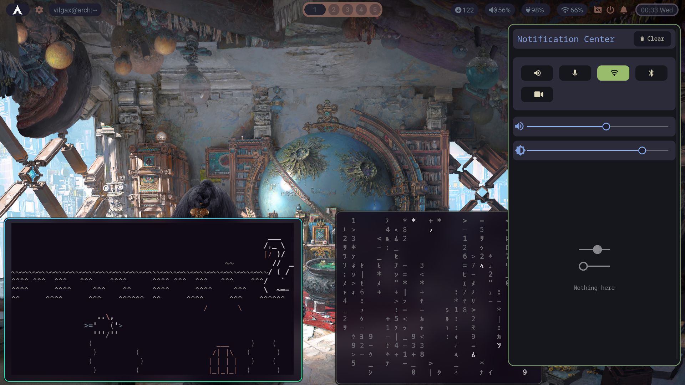
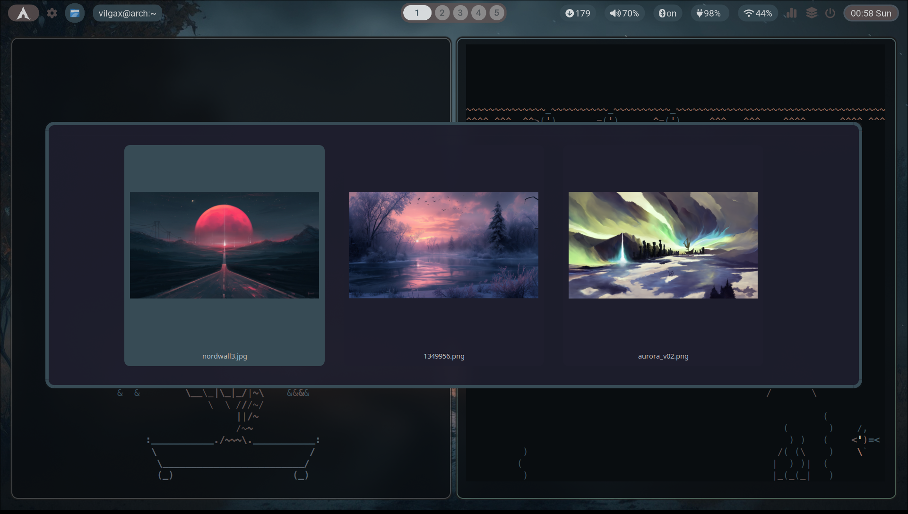
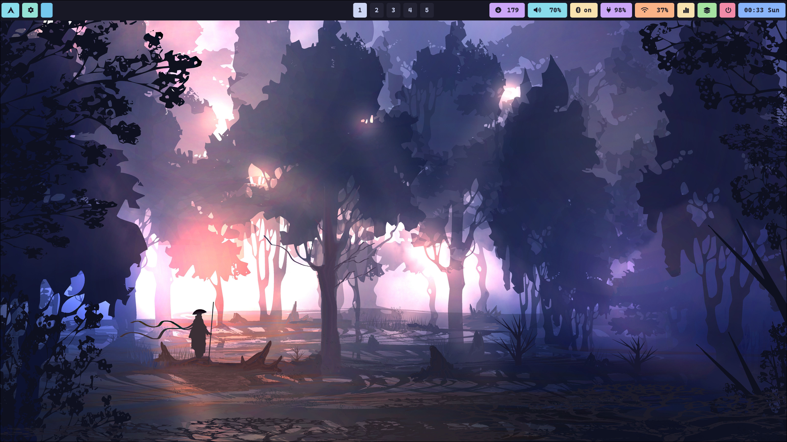
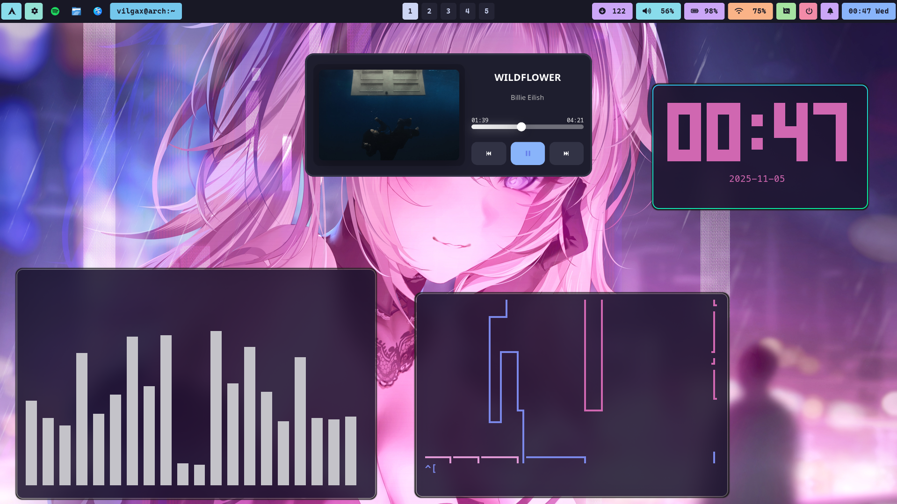
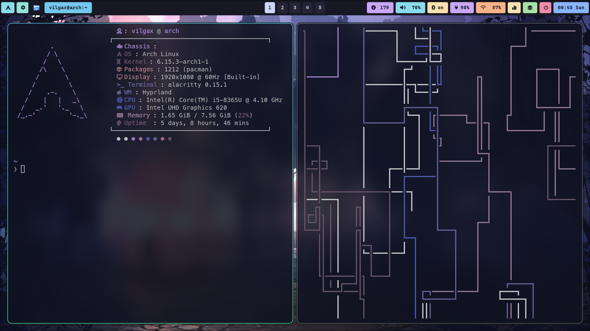
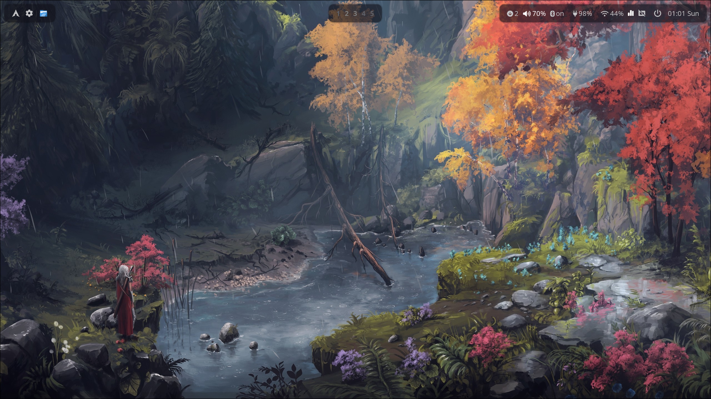
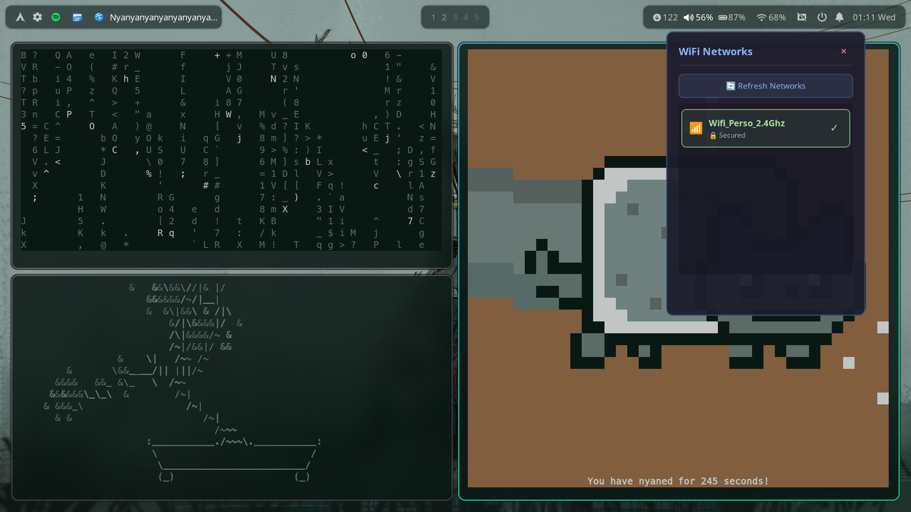
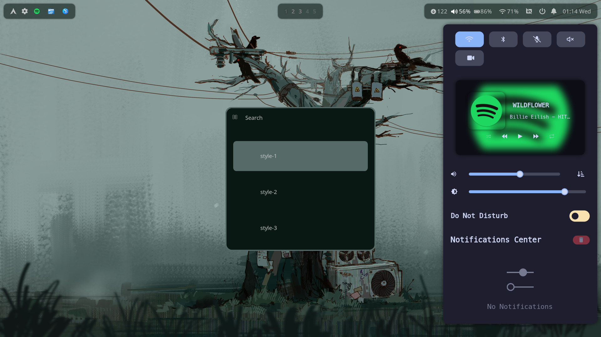

# dotfiles

<p align="center">
  
  
  
</p>

---

Welcome to my personal dotfiles repository! This setup is built on [**Arch Linux**](https://archlinux.org/) using the [**Hyprland**](https://github.com/hyprwm/Hyprland) dynamic tiling Wayland compositor. It's fast, minimal, and customized for a beautiful and productive workflow.

# Preview

## Style 1







## Style 2







## Style 3







# System Overview

| Category          | Software                                      |
|-------------------|-----------------------------------------------|
| OS                | [**Arch Linux**](https://archlinux.org/) |
| WM                | [**hyprland**](https://github.com/hyprwm/Hyprland) |
| Terminal          | [**alacritty**](https://github.com/alacritty/alacritty) |
| Bar               | [**waybar**](https://github.com/Alexays/Waybar) |
| Launcher          | [**rofi**](https://github.com/davatorium/rofi) |
| Shell             | [**bash + starship**](https://starship.rs/) |
| Text Editor       | [**vim**](https://www.vim.org/)      |
| IDE               | [**neovim**](https://www.lazyvim.org/)      |
| Wallpaper Daemon  | [**swww**](https://github.com/LGFae/swww) + [**pywal**](https://pypi.org/project/pywal/) |
| Notifications     | [**swaync**](https://github.com/ErikReider/SwayNotificationCenter) |
| File Manager      | [**dolphin**](https://apps.kde.org/dolphin/) |
| Music Player      | [**mpd + mpc**](https://github.com/MusicPlayerDaemon/MPD) |
| Clipboard manager | [**cliphist**](https://www.cliphist.com/) |
| Cursor            | [**Bibata Modern Ice**](https://www.gnome-look.org/p/1197198) |
| Fetch displayer   | [**fastfetch**](https://github.com/fastfetch-cli/fastfetch) |
| OSD               | [**swayosd**](https://github.com/ErikReider/SwayOSD)      |
| Logout menu       | [**wlogout**](https://github.com/ArtsyMacaw/wlogout) |
| Lockscreen        | [**hyprlock**](https://github.com/hyprwm/hyprlock) |
| Widgets           | [**eww**](https://github.com/elkowar/eww)      |
| Idle daemon       | [**hypridle**](https://github.com/hyprwm/hypridle) |


# Installation

> ⚠️ Warning: This assumes you're using Arch Linux or an Arch-based distro.

## Prerequisites

### Hyprland & Tools
```bash
sudo pacman -S hyprland hyprlock hyprpaper hyprcursor hypridle waybar cliphist brightnessctl pavucontrol cava mpd mpc rofi swww dunst flameshot fastfetch yazi neovim
yay -S waypaper wlogout xwayland-run pacseek eww-git swaync swayosd-git
```

### Fonts
```bash
yay -S ttf-font-awesome ttf-roboto ttf-cascadia-code-nerd ttf-hack ttf-jetbrains-mono noto-fonts adwaita-fonts noto-fonts-emoji
```

### Themes
```bash
yay -S bibata-cursor-theme catppuccin-gtk-theme-mocha python-pywal16 python-pywalfox
sudo pacman -S kvantum qt5ct qt6ct nwg-look
```

### Terminal & Tools
```bash
sudo pacman -S fzf alacritty ghostty vim starship eza
yay -S yt-x
```


## Clone the repository:
```bash
git clone https://github.com/Wnanovex/dotfiles.git
cd dotfiles
```

# Keybindings
                                   
| Keybinding              | Description                     |
|-------------------------|---------------------------------|
| `SUPER + Return`        | Open terminal (`Alacritty`)        |
| `SUPER + Shift + C`     | Kill active window               |
| `SUPER + Shift + Q`     | Exit Hyprland session            |
| `SUPER + D`             | Open file manager (`Dolphin`)      |
| `SUPER + Space`         | Launch application menu (`Rofi`)   |
| `SUPER + Y`             | Update colorscheme & wallpaper   |
| `SUPER + P`             | Select wallpaper script          |
| `SUPER + Shift + T`     | Switch themes                   |
| `SUPER + Shift + S`     | Take Screenshot                   |
| `SUPER + Shift + M`     | Toggle music player                  |
| `SUPER + V`             | Clipboard history manager        |


